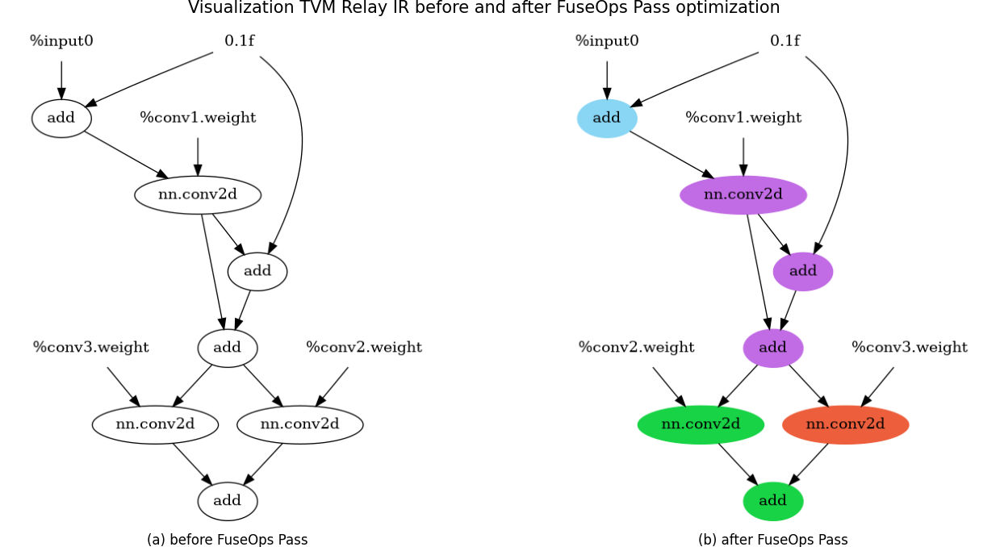
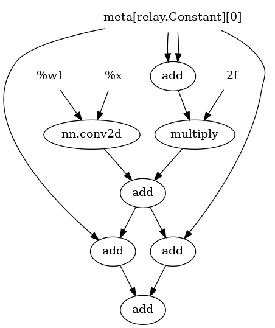
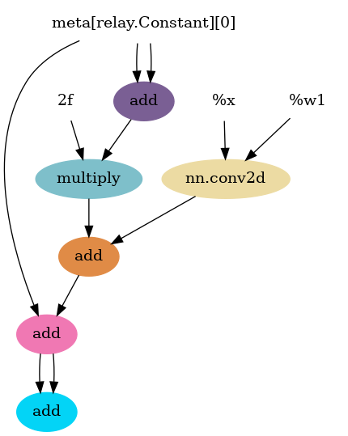
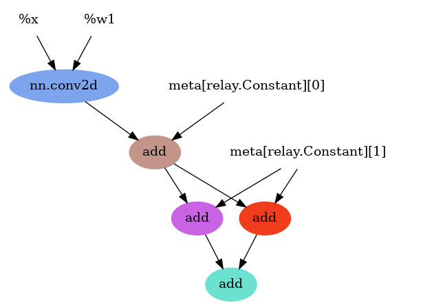
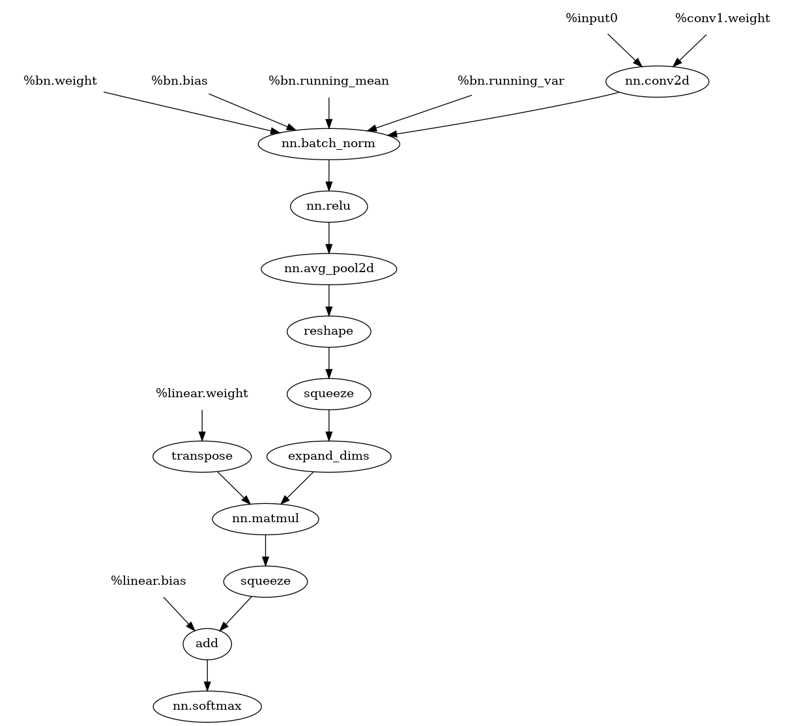
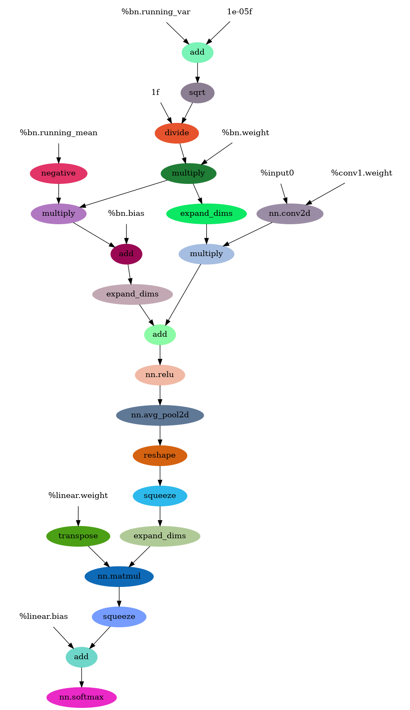
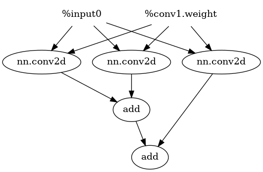
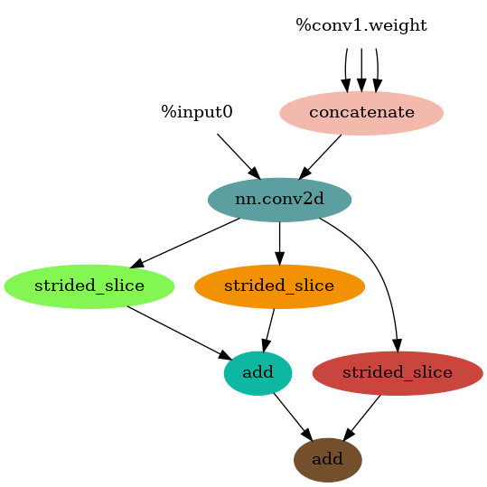
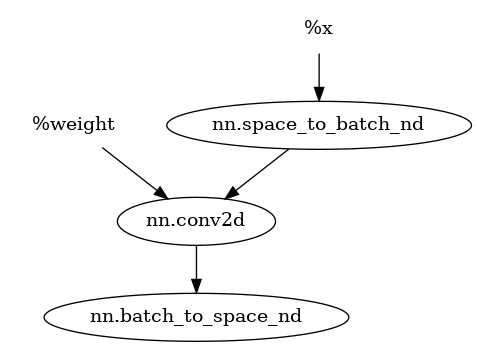

<p align="center"><h1 align="center">VisuTVM</h1></p>

<p align="center">
    <a href=""></a>
    <a href="./LICENSE"></a>
    <a href=""></a>
    <a href=""></a>
</p>

TVM Relay IR Visualization Tool (TVM 可视化工具)

## Introduction

Visualize the TVM's Relay IR structure, and support the visualization of Pass optimized Relay IR.

<p align="center">

</p>

    👉note：In the example(b), the nodes with the same color are fused.

## Usage

```bash
# add env path
export PYTHONPATH=$PYTHONPATH:${your-path}/VisuTVM

# visu relay ir(default: FuseOps)
python main.py -bp relay_ir/example_fo_bp.txt -ap relay_ir/example_fo_ap.txt -sn example

# create relay ir txt file
python examples/example.py --passname FuseOps
```

## Installation

- **Step1**: install [graphviz](https://graphviz.org/download/)
- **Step2**: install graphviz's python API

  ```bash
  pip install graphviz
  ```

## Supported Pass

- FuseOps
- RemoveUnusedFunctions`(no case)`
- ToBasicBlockNormalForm`(no case)`
- EliminateCommonSubexpr
- FoldConstant
- SimplifyInference
- CombineParallelConv2D
- CombineParallelDense
- CombineParallelBatchMatmul
- FoldScaleAxis
- SimplifyExpr
- CanonicalizeCast`(no case)`
- CanonicalizeOps`(no case)`
- FlattenAtrousConv
- FastMath

## Preview

🚀️ EliminateCommonSubexpr Pass

<table align="center"><tr>
<td></td>
<td></td>
</tr></table>

🚀️ FoldConstant Pass

<table align="center"><tr>
<td></td>
<td></td>
</tr></table>

🚀️ SimplifyInference Pass

<table align="center"><tr>
<td></td>
<td></td>
</tr></table>

🚀️ CombineParallelConv2D

<table align="center"><tr>
<td></td>
<td></td>
</tr></table>

🚀️ FlattenAtrousConv

<table align="center"><tr>
<td></td>
<td></td>
</tr></table>

## Q&A

在使用过程中遇到可视化失败的Relay IR网络结构，可以在 [issues](https://github.com/xiayouran/VisuTVM/issues) 上提出你的问题，如果有任何好的想法，也可以进行交流哦👏👏👏
